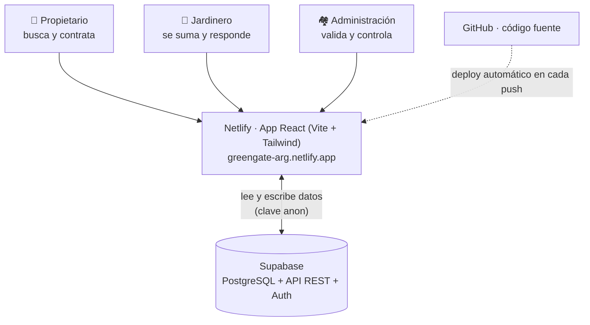

# GreenGate · Arquitectura de la solución

Documento de referencia sobre cómo está construida y desplegada la plataforma GreenGate en su etapa de piloto/MVP.

## Resumen ejecutivo

GreenGate es una aplicación web (marketplace B2B2C para barrios privados) construida con un enfoque **serverless**: no tiene un servidor propio que programar y mantener. La aplicación corre en el navegador del usuario y se comunica directamente con **Supabase**, que provee la base de datos y una **API REST generada automáticamente**. El hosting es **Netlify** y el código vive en **GitHub**, con despliegue automático en cada cambio. Todo funciona sobre planes gratuitos: **costo ≈ USD 0/mes**.

## Diagrama



## Los tres pilares

| Pieza | Rol | Plan |
|---|---|---|
| **Supabase** | Base de datos PostgreSQL + API REST automática + (a futuro) login/Auth y almacenamiento | Free |
| **Netlify** | Compila y publica la app en internet; despliegue automático desde GitHub | Free |
| **GitHub** | Repositorio del código y su historial de cambios | Free |

## La decisión clave: sin backend propio

Una aplicación de este tipo suele necesitar **tres piezas**: la app (frontend), un **backend** propio (un servidor a medida que hay que programar, hostear y mantener) y la base de datos.

GreenGate elimina la pieza del medio: **Supabase genera la API automáticamente a partir de la estructura de la base de datos**, y la app le habla directo. Esto significa una capa menos que construir, pagar y mantener — una decisión deliberada para un equipo sin perfil técnico y con presupuesto cero en la etapa de validación. Cuando el proyecto escale, se puede sumar un backend a medida sobre la misma base sin rehacer nada.

## Stack técnico

- **Frontend:** React + Vite + TypeScript + Tailwind CSS. Es una SPA (single-page application) estática: se compila a archivos HTML/JS/CSS que Netlify sirve. La navegación entre las vistas (Propietario / Jardinero / Administración) ocurre en el navegador.
- **Datos y API:** Supabase (PostgreSQL gestionado). La app usa la librería `@supabase/supabase-js` para leer y escribir.
- **Hosting:** Netlify (deploy continuo conectado al repo).
- **Control de versiones:** Git + GitHub.

## Los dos flujos

**1. Uso diario (lo que hace un usuario):**
El usuario abre la URL → se descarga la app en su navegador → la app pide y guarda datos directamente en Supabase mediante la API REST, usando la *clave anon* (pública, pensada para ir en el frontend).

**2. Desarrollo (cómo se hacen cambios):**
Se edita el código → se confirma (`commit`) y se sube (`push`) a GitHub → Netlify detecta el cambio, compila la app y la publica automáticamente en 1–2 minutos.

> Durante el desarrollo se puede usar un servidor local (`npm run dev`, en `localhost:5173`) para ver los cambios al instante antes de publicarlos. Para el uso normal, alcanza con la URL de Netlify.

## Modelo de datos

Vive dentro de Supabase (PostgreSQL): **15 tablas + 1 vista**. El lenguaje del dominio está en español.

**Entidades principales:**
- `administracion` — el cliente B2B (la administradora del barrio).
- `barrio` — cada barrio/country (una administración gestiona varios).
- `lote` — la unidad funcional dentro de un barrio.
- `propietario` — el vecino (demanda).
- `prestador` — la oferta (jardineros; el campo `tipo_servicio` deja la puerta abierta a otros rubros). Puede ser una persona sola o un equipo.
- `integrante` — cada persona real de un prestador-equipo. Antecedentes e identidad se verifican por persona; el seguro queda compartido a nivel del prestador. Un prestador unipersonal no usa esta tabla.
- `verificacion` — estado de la documentación (del prestador entero, o de un integrante puntual).
- `trabajo` — cada servicio realizado (precio, método de pago, comisión de la plataforma).
- `valoracion` — reseña de un trabajo (de acá se calcula el puntaje).
- `solicitud` — pedido de contacto de un propietario a un prestador.

**Tablas de apoyo:** `prestador_servicio` (especialidades), `prestador_barrio` (habilitación por barrio), `prestador_foto` (portfolio), `ingreso` (trazabilidad de accesos, Fase 2) y `perfil` (vínculo con el login, a futuro).

**Vista `prestador_directorio`:** calcula, para cada prestador, el puntaje promedio y la cantidad de reseñas. Las insignias de verificación (antecedentes/seguro/identidad) **no** viven en esta vista — las calcula `src/verificacion.ts` en el frontend, porque para un equipo hace falta cruzar los datos de cada integrante, algo que un `exists()` simple en SQL no puede expresar bien sin arriesgar una segunda fuente de verdad.

Detalle completo del esquema: [`supabase/schema.sql`](../supabase/schema.sql) · explicación en lenguaje simple: [`docs/modelo-de-datos.md`](modelo-de-datos.md).

## Configuración y claves

Las claves de conexión a Supabase **no se guardan en el código** (nunca se suben a GitHub). Se manejan como **variables de entorno**:
- `VITE_SUPABASE_URL` — la dirección del proyecto Supabase.
- `VITE_SUPABASE_ANON_KEY` — la clave pública de acceso.

En desarrollo local viven en un archivo `.env` (ignorado por Git). En producción se cargan en el panel de **Netlify → Environment variables**, y se aplican al compilar. Por eso, al publicar, hubo que cargarlas ahí.

## Seguridad — estado actual (piloto)

- 🔓 **RLS (Row Level Security) desactivado.** En modo piloto, sin login, la base está abierta a quien tenga el link (puede leer y escribir). Es aceptable **únicamente porque los datos actuales son ficticios/de ejemplo**.
- 📄 **`supabase/policies.sql`** ya contiene el borrador de las políticas de seguridad por barrio/rol, listas para activar cuando se sume el login.
- ⚖️ **Datos sensibles.** Las verificaciones guardan **solo el estado** (verificado / vencido / etc.) y las fechas, **nunca el documento** (antecedentes penales, póliza). Es una decisión de diseño por la **Ley 25.326** de Protección de Datos Personales de Argentina.
- 🔑 La *clave anon* es pública por diseño (va en el frontend); lo que protege los datos es el RLS, hoy apagado a propósito para el piloto.

## Costos y limitaciones

- **Costo: ≈ USD 0/mes** (todo en planes gratuitos de Supabase, Netlify y GitHub).
- **Limitación del plan gratuito de Supabase:** el proyecto **se pausa automáticamente tras ~1 semana de inactividad**. Cuando pasa, la app muestra "Failed to fetch"; se reactiva desde el dashboard de Supabase con el botón **Restore/Resume** (los datos se conservan). Si más adelante se necesita disponibilidad permanente, el plan pago de Supabase (~USD 25/mes) evita las pausas.

## Estructura del repositorio

```
greengate/
├── src/                    App React (vistas, componentes, cliente Supabase)
├── supabase/
│   ├── schema.sql          Esquema de la base (15 tablas + vista)
│   ├── seed.sql            Datos de ejemplo (barrios de zona norte)
│   ├── migracion-solicitudes.sql
│   ├── migracion-integrantes.sql
│   ├── rls-dev.sql         Desactiva RLS para el piloto
│   └── policies.sql        Políticas de seguridad (borrador, para el login)
├── docs/
│   ├── arquitectura.md     (este documento)
│   └── modelo-de-datos.md  El modelo explicado sin tecnicismos
├── netlify.toml            Configuración de despliegue
└── .env.example            Plantilla de variables de entorno
```

## Roadmap arquitectónico (lo que falta)

1. **Login (Supabase Auth) + reactivar RLS.** Es el paso que habilita operar con **datos reales**: cada usuario entra con su rol (administración / propietario / prestador) y solo ve/edita lo que le corresponde.
2. **Fase 2:** integración con el sistema de control de accesos del barrio (trazabilidad de ingresos), cobro digital (MercadoPago) y agenda con optimización de rutas.

## Accesos

| Recurso | Dirección |
|---|---|
| App publicada | https://greengate-arg.netlify.app |
| Repositorio | https://github.com/gpuentes-wq/GreenGate |
| Proyecto Supabase | https://supabase.com/dashboard (proyecto GreenGate) |

---

*Universidad de San Andrés · Maestría en Negocios Digitales (NBL) · Proyecto GreenGate*
